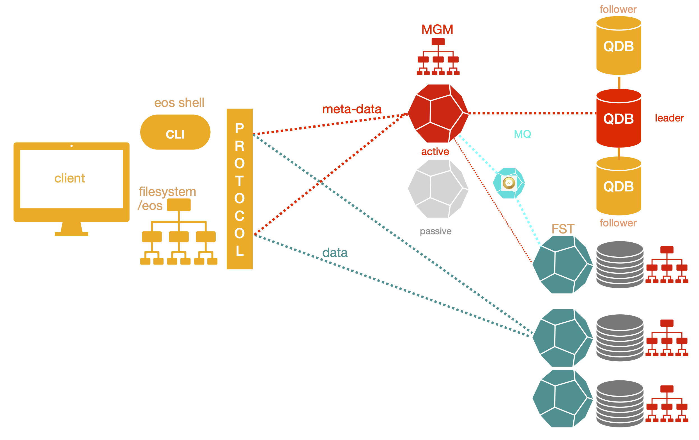
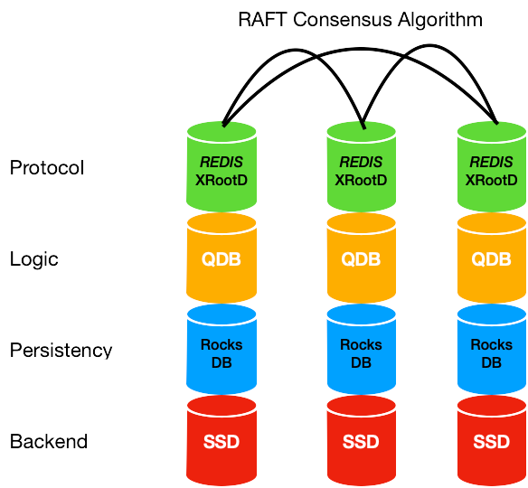
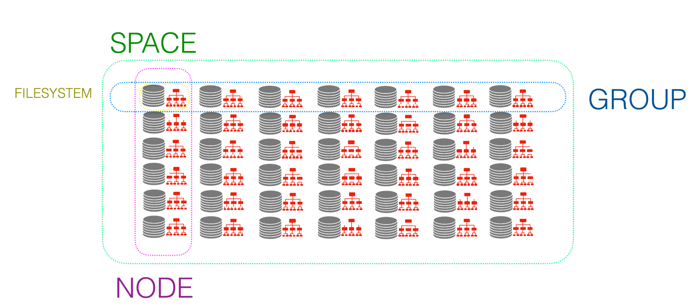
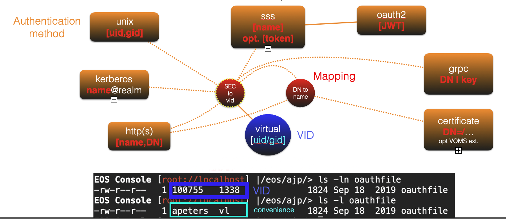

.. index::
   single: Architecture

=====================
Design & Architecture
=====================

**EOS** was designed as a file storage system with low-latency access for physics analysis.

The core file access protocol in EOS is the **XRootD** protocol: it provides additional features when compared to widespread protocols like FTP, NFS or HTTP(S) e.g

* **strong authentication** mechanisms
* a versatile **redirection protocol** used to separate metadata and data access, for storage federations and error recovery
* efficient **remote file access** in LAN and WAN environments through latency compensation techniques using vector read and write requests
* **third-party copy mechanism** **TPC** including a file integrity check based on file checksums on both ends
* a wait instruction to let a client replay a request after a given time period and a waitresp instruction to let a client wait for an asynchronous callback response from the server

The current production version of EOS is named like a gemstone: Diopside.  The Version for the production 
release is 5.X (EOS5).

Schema
------

Service Components
------------------

EOS is composed of four core services 

* **MGM** - providing a hierarchical namespace and meta-ata access
* **MQ** - providing asynchronous messaging between MGM and FST services
* **FST** - providing file storage service
* **QDB** - providing a high-available KV store to persiste meta-data of the MGM 

EOS provides additional native access protocols using a protocol plugin for **HTTP(S)** (XrdHttp) or via gateways for **S3** (MiniO), **CIFS** (Samba) and **SFTP** (sshfs) using a FUSE client implementation (eosxd). FUSE allows to mount EOS as a filesystem preserving the aforementioned feature set of **XRootD**. In particular, all strong authentication protocols and token authorization are supported also by the FUSE implementation. For user and administrator interaction EOS provides a command-line interface invoked using the EOS shell
`eos`
Besides the shell the following native XRootD clients are usable:

* **xrdcp** - copy application
* **xrd** - filesystem application (listing, deletion ...)
* **XrdCl** - C++ client library

Namespace
---------

The namespace(meta-data service) of EOS5 runs on a single node and is not horizontal scalable. The architecture foresees to have standby nodes, which take over the MGM service if the active node becomes unavailable.

The namespace is implemented as an LRU driven in-memory cache with a write-back queue and QuarkDB as external KV store for persistency.  QuarkDB is a high-available transactional KV store using the RAFT consensus algorithm implementing a subset of the REDIS protocol. A default QuarkDB setup consists of three nodes, which elect a leader to serve/store data.
KV data is stored in RocksDB databases on each node. 

Replication from leader to follower(s) is using RAFT journals. The supported data structures are **hashes, sets, strings, leases, multi** and **pubsub**. 

Views
-----

EOS provides four conceptual views on filesystems storing data:
* space view
* node ivew
* group view
* fs view

The *fs view* contains all the configured filesystems. The *node view* arranges filesystems grouped by their hosting FST node. The *group view* arranges filesystems grouped by their scheduling group. The *space view* lists filesystems by placement space. What is called a *space* in EOS is called a *pool* in other storage systems. What is called *scheduling group* in EOS is often called *placement group* in other implementations.

Filesystems are identified by a storage path, the host where they are attached, an internal filesystem ID assigned by EOS (1..65534) and a randomly generated UUID, which serves as an identification label stored on each filesystem.

Mapping
-------

EOS has a very feature rich interface for authentication and user mapping: the virtual ID concept. Clients are mapped based on their chosen authentication method and rules to a virtual identity `vid` (uid/gid pair) inside EOS, which defines the ownership of files and directories. Besides dynamic mapping you can assign `roles` to each `vid`. This is useful if you want to allow people/services to act on behalf of everyone or a subset of identities.

Policies
--------

EOS allows to define storage policies e.g. how files are stored or which checksums are computed for files, when they have been uploaded. These policies are defined with the following scopes:
* Space policies - they are valid for everything happening within a given space
* Application/Group/User policies - they are valid for identified client applications/groups/users
* Directory policies - they are valid for children inside a directory
* URL policies - they are attached to a single operation as part of a URL

A simple example of a directory policy to define to store files erasure coded on 12 HDDs is shown here:

.. code-block:: bash
    
   eos attr ls /eos/attrdir
   sys.forced.layout="raid6" 
   sys.forced.nstripes="12" 
   sys.forced.space="erasure"

GEO Tagging and Scheduling
--------------------------

EOS allows to assign GEO tags to clients based on IPs and to each node hosting filesystems. The client GEO tags are used to match against filesystem GEO tags to apply various placement policies e.g. a possible placement policy could be to store files as close as possible to a client.

Microservices
--------------

Each EOS system contains a set of configurable microservices. 

* **Balancers** - three services to balance the volume usage on filesystems under various aspects
   * Balancer       - Balancing usage between filesystems inside each group
   * Group Balancer - Balancing usage between groups within a space
   * Geo Balancer   - Balancing usage between geographic locations
* **Converter Engine** - a queue system to execute jobs to change how a file is stored e.g. change from single to two-fold replication
* **Lifecycle Management** - automation for disk/node replacement e.g. empty a disk which should go out of production
* **LRU Engine** - a service to trigger clean-up or conversion policies by scanning the EOS namespace e.g. create a temporary space where files get automatically cleaned up after 30 days
* **Inspector** - an accounting service reporting statistics how files are stored in an EOS instance e.g. to see how much data in an instance is stored with replication or erasure coding
* **Storage Consistency Check and Repair** - a distributed service to identify inconsistencies in data and meta-data and to run automatic repair actions to achieve consistency
* **Workflow Engine** - a queue system processing storage events e.g. to inform an external service like the CERN Tape Archive service that a new file has been uploaded and should be migrated to tape storage

