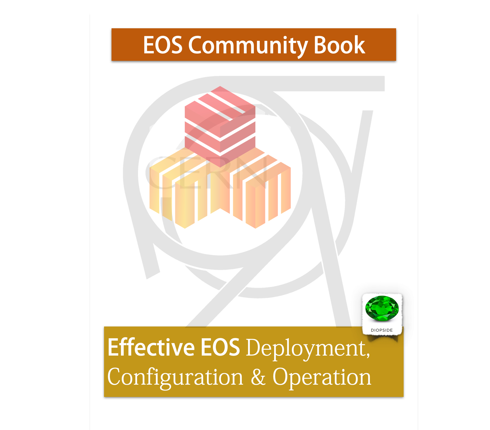

:orphan:

.. _index:

EOS - Open Storage Documentation
================================

**EOS** is an open-source storage software solution to manage Exabyte storage for the CERN Large Hadron Collidor `LHC <https://home.cern/topics/large-hadron-collider>`_. Core of the implementation is the `XRootD <http://xrootd.org>`_ framework providing a feature-rich remote access protocol. 

.. toctree::
   :numbered: 2
   :maxdepth: 1

   introduction/index.rst
   architecture/index.rst
   releases/index.rst
   manual/index.rst
   faq/index.rst
   blog/features.rst
.. develop
.. restapi
.. taperestapi
   A. QuarkDB Documentation <https://quarkdb.web.cern.ch>

