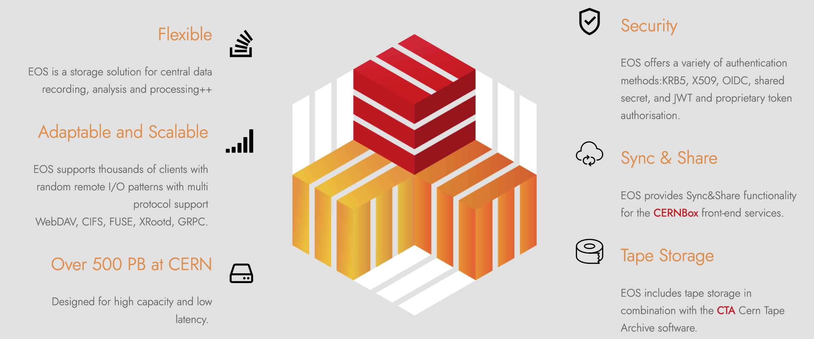
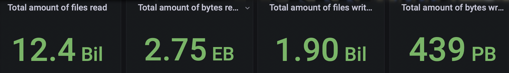
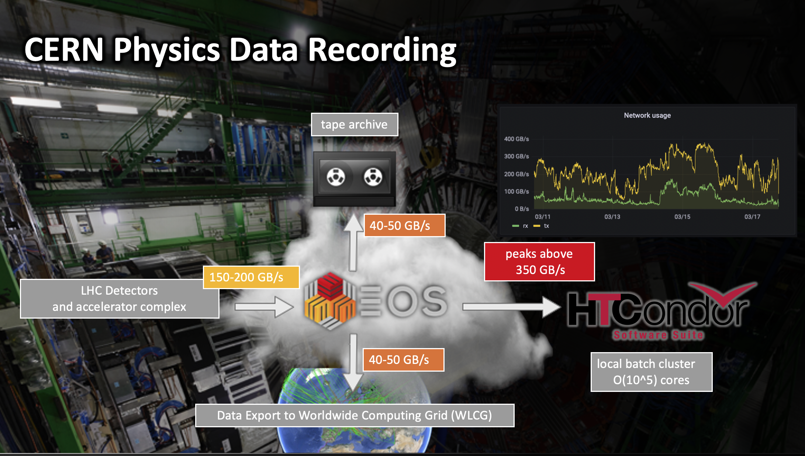

.. _introduction:

.. index::
   single: Introduction

============
Introduction
============

*EOS Open Storage combines and re-enacts concepts of filesystem, archive and cloud storage.*

The `EOS <https://eos.web.cern.ch>`_ storage system was created for the extreme computing requirements at the Large Hadron Collider (`LHC <https://lhc.web.cern.ch>`_) at CERN. EOS stands for EOS Open Storage and started as a disk-only storage system developed since 2010 at CERN. EOS is deployed as storage service at CERN and in dozens of other installations in the Worldwide LHC Computing GRID community (WLCG), at the Joint Research Centre of the European Commission and the Australian Academic and Research Network.

EOS Open Storage at CERN
------------------------

EOS instances at CERN store more than seven billion files and provide 780 petabytes of disk storage capacity using over 60k hard drives (as of June 2022), matching the exceptional performance of the LHC machine and experiments. 

Over 12k scientists of 110 nationalities, from institutes in more than 70 countries have access to data stored in EOS using remote access protocols and a mounted filesystem interface. EOS represents the foundation of many services at CERN. 

CTA - Tape Storage
------------------------

The CERN Tape Archive `CTA <https://cta.web.cern.ch>`_ uses EOS as the user facing disk storage system which connects to the tape infrastructure and additional tape services. The integrated data stored on tape will exceed 1 exabyte during 2023. 

CERNBox - Sync & Share
------------------------

A second CERN service leveraging EOS functionality is `CERNBox <cernbox.web.cern.ch>`_. CERNBox provides Sync&Share functionality offering at least 1 terabyte of personal space to users or projects. Other features include a web portal, sync clients for most common platforms and reliance on the open-source ownCloud file hosting suite.

History
-------
The EOS project was started in April 2010 in the CERN IT data storage group. 

Driving Development
------------------------
EOS development has been driven over the last decade by requirements coming from the above use cases and a very diverse user community. Several features and functionalities of EOS are provided in neither conventional POSIX oriented nor cloud storage systems. 

Goal
----

The main goal of the project is to provide fast and reliable disk only storage technology for CERN LHC use cases. The following picture demonstrates the main use case at CERN:

Software Versions
-----------------

The stable production version called **Diopside** is currently EOS V5.

License
-------
EOS is available under GPL v3 `license <https://raw.githubusercontent.com/cern-eos/eos/master/License>`_. 

