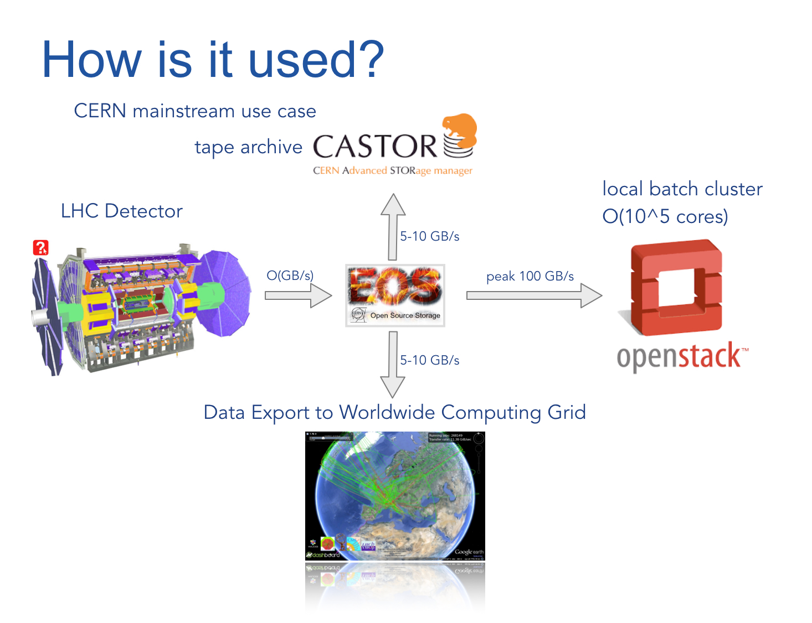
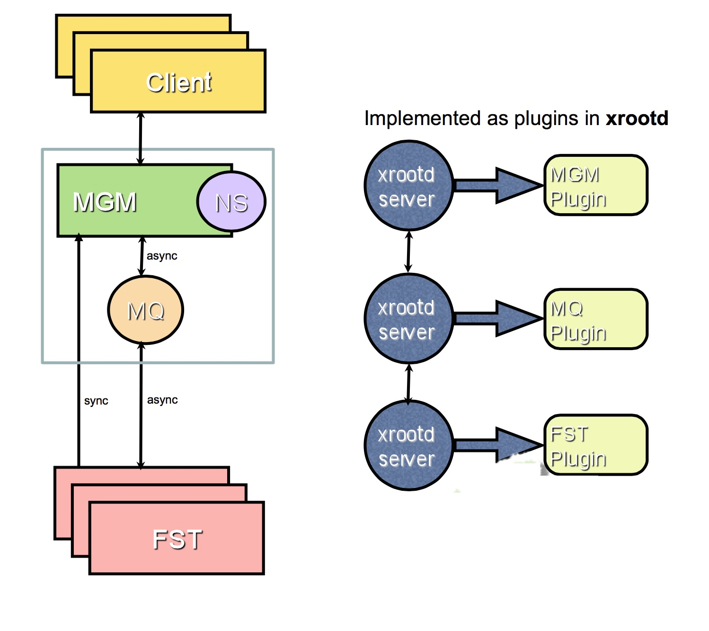

.. highlight:: rst

Introduction
=======================
.. image:: lhc.jpg
   :align: center

History
-------
The `EOS <http:://eos.cern.ch>`_ project was started in April 2010 in the CERN IT data storage group. 

Goal
----

The main goal of the project is to provide fast and reliable disk only storage technology for CERN `LHC <https://home.cern/topics/large-hadron-collider>`_ use cases. The following picture demonstrates the main use case at CERN:

Software Versions
-----------------
The phasing-out production versions is called **Beryl/Aquamarine** v0.3.X.

The stable production version called **Citrine** is currently v4.2.X

License
-------
Since release version 0.1.1 EOS is available under GPL v3 license. 

Architecture
------------

EOS is made by three components:

* **MGM** - metadata server
* **FST** - storage server
* **MQ** - message broker for asynchronous messaging

The initial architecture is using an in-memory namespace implementation with a master-slave high-availability model. This implementation provides very low-latency for meta data acccess. 

Since the CITRINE release the architecture has been modified to provide optinal an in-memory namespace cache and a KV store for persistency. This was necessary to overcome the scalability limitation of the meta-data service given by the maximum available RAM of **MGM** nodes.

EOS is implemented using the `XRootD Framework <https://xrootd.org>`_.  

.. image:: eos-architecture.jpg
   :scale: 30 %
   :align: center

Storage Concepts
----------------

EOS uses a storage index concept to identify where and how files are stored. These information is stored inside the meta data of each file. 

Files are stored with a a so called **layout**. The following layouts are supported

* **plain** - a file is stored as a plain file in one filesystem
* **replica** - a file is stored with a variable number of replicas in `n` filesystems
* **rain** - reed-solomon encoded files with data and parity blocks 
  
  * raid6 - a file is chunked into blocks and stored in `n-2` filesystems for data and `2` filesystems for parity blocks
  * archive - a file is chunked into blcoks and stored in `n-3` filesystems for data and `3` filesystems for parity blocks

EOS groups storage resources into three logical categories:

* **spaces**
* **groups**
* **filesystems**

A **space** is used to reference a physical location when files are placed by the storage system. **spaces** are made by placement **groups**. **groups** consist of one or many filesystems. The EOS scheduler selects a **group** to store all replicas or chunks of a file are stored within a single **group**. Therefore the filesystems within a group should never be on the same node to guarantee availability with node failures.

Protocols and Clients
---------------------

The native protocol is the **xrootd** protocol, which providess additional functionalities like vector reads, third party copy transfers etc. 

A second embedded protocol is **http/webdav** currently implemented using `libmicrohttpd`. 

EOS can be used like a filesystem using FUSE clients. There are two implementations available:

* **eosd** - available for BERYL and CITRINE - limited POSIX conformity
* **eosxd** - available for CITRINE - improved POSIX conformity, cross-client consistency aso. 

EOS has been extended to work simliar to `Owncloud <owncloud.org>`_ as a sync and share platform. The branded product is called `CERNBox <https://cernbox.web.cern.ch>`_. 

.. IMAGE:: cernbox.jpg
   :scale: 40%
   :align: center

Architecture Roadmap
--------------------

The target architecture for the next major release version is shown in the following figure:

.. IMAGE:: roadmap-2018.jpg
   :scale: 60%
   :align: center

The goal is to reach full scalability and high-availability of all service components and to embed better external storage resources like shared filesystems and cloud storage.

