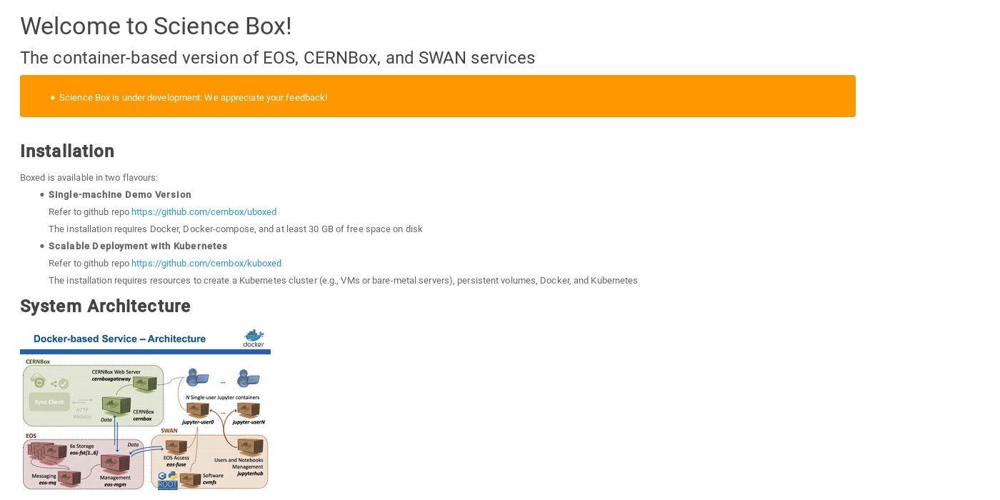

.. index::
   single: Boxed

.. _eos_base_boxed:

.. _boxed: http://sciencebox.web.cern.ch/sciencebox

Scientific Services Installation: EOS, CERNBox, SWAN and CVMFS
==============================================================

.. image:: cernlogo.jpg
   :scale: 35 %
   :align: left

|
|

We have bundled a demonstration setup of four CERN developed cloud and analysis platform services called `Boxed <http://sciencebox.web.cern.ch/sciencebox/>`_. It encapsulates four components:

- `EOS <http://eos.cern.ch>`_ - scalable storage platform with data, metadata and messaging server components
- `CERNBox <https://cernbox.web.cern.ch>`_ - dropbox-like add-on for sync-and-share services on top of EOS
- `SWAN <https://swan.web.cern.ch>`_ - service for web based interactive analysis with jupyter notebook interface
- `CVMFS <https://cvmfs.web.cern.ch>`_ - CernVM file system - a scalable software distribution service

Checkout the project of your interest and follow the guidelines at http://sciencebox.web.cern.ch/sciencebox

