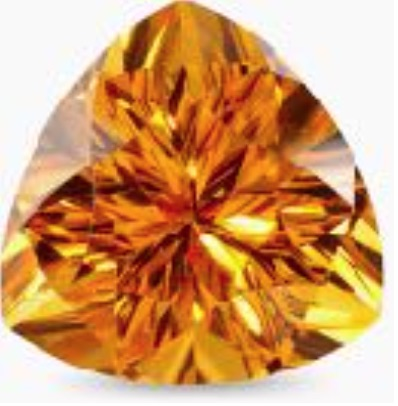

i.. highlight:: rst

.. index::
   single: Releases

Releases
========

EOS releases are named after gemstones. The actively developed version is called CITRINE.

.. toctree::
   :maxdepth: 1

   releases/amber
   releases/beryl
   releases/citrine

.. epigraph::

   ================================= =================== =================== =================================
   Release                           Stable Version      Description         Release Notes
   ================================= =================== =================== =================================
   :doc:`releases/amber`             0.2.47              1st EOS Generation
   :doc:`releases/beryl`             0.3.267-aquamarine  2nd EOS Generation  :doc:`releases/beryl-release`
   :doc:`releases/citrine`           4.8.63              3rd EOS Generation  :doc:`releases/citrine-release`
   ================================= =================== =================== =================================
