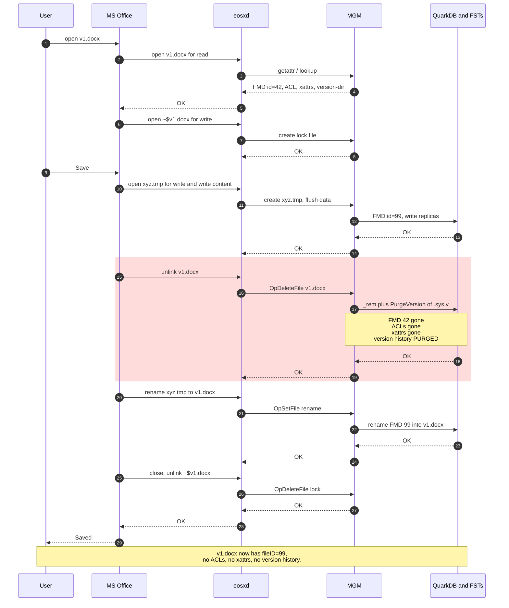
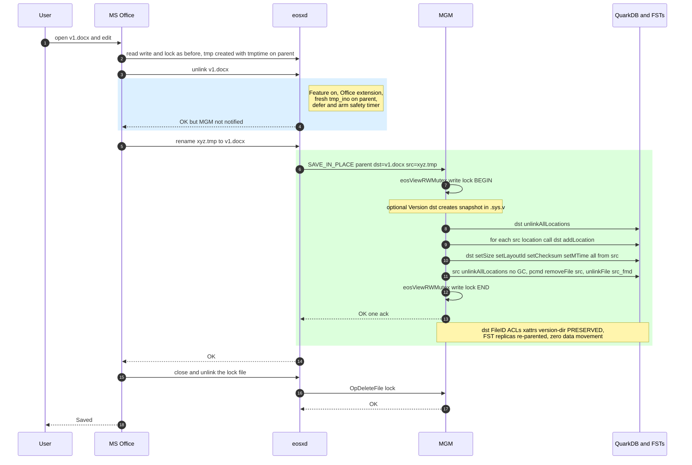
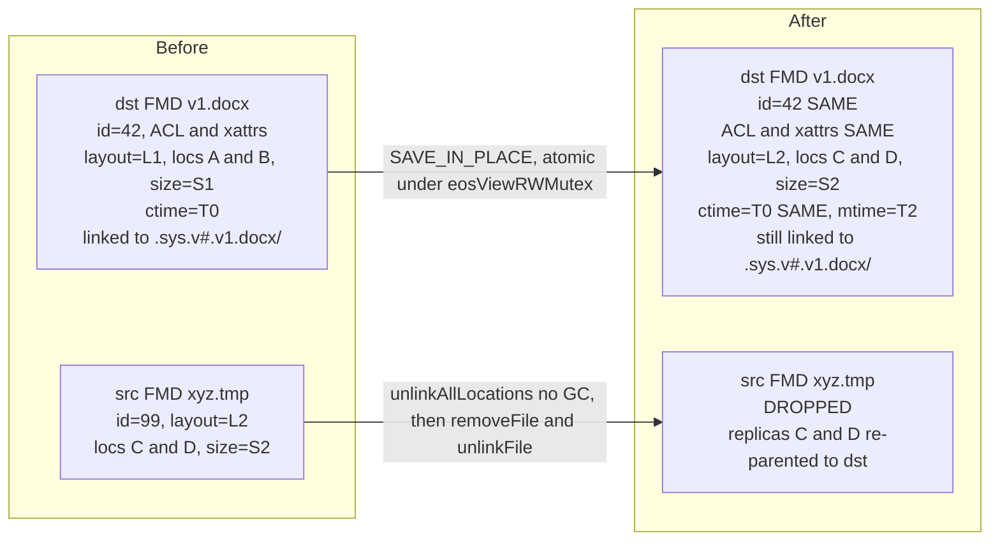
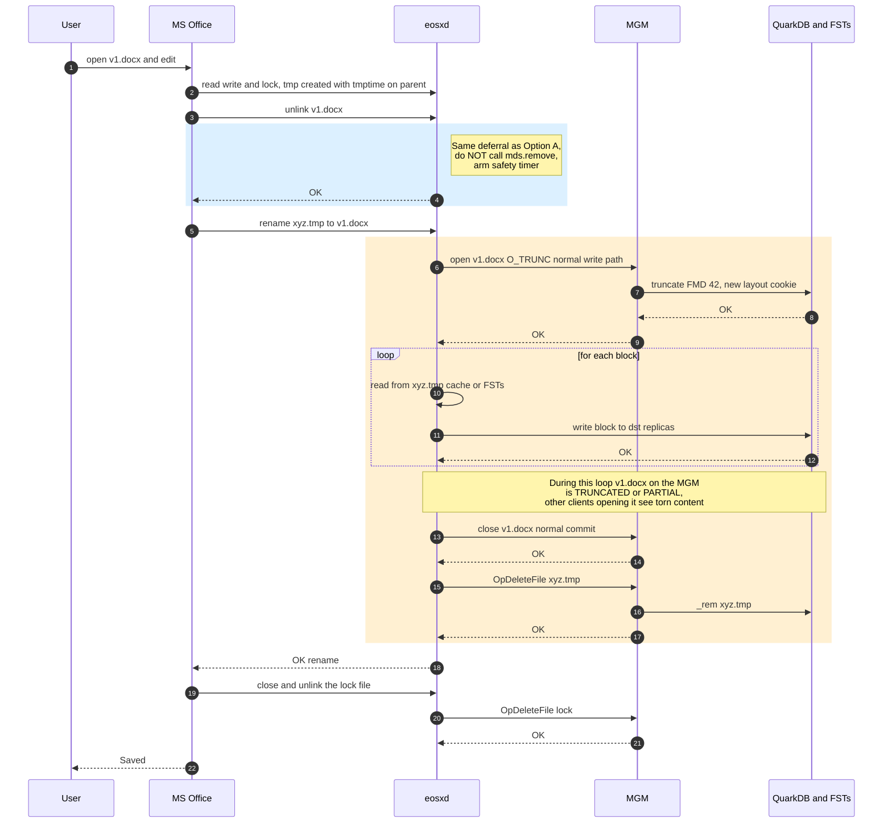

# Preserving file identity and version history across MS Office saves via `eosxd`

> **SUPERSEDED 2026-04-24.** The two patterns analysed in this document (`rm v1.docx` + `mv xyz.tmp v1.docx`) turned out not to match the observed Office behaviour. The actual Office sequence is **`mv doc1.docx YYYYYY.tmp` + `mv XXXXXX.tmp doc1.docx` + `rm YYYYYY.tmp`** while `~$doc1.docx` is present. The current mitigation is the `hack-ms-office-file-save` config flag + two rename-time hooks in `fusex/eosxd/eosfuse.cc`. That mitigation preserves destination xattrs (`sys.acl`, `user.*`) but **not** FileID and **not** the `.sys.v#.<name>/` version directory. This document is kept for historical context only.

*Status: decision document — no code has been written. Two options are presented for team review.*

---

## 1. Problem statement

When a user edits a `.docx` / `.xlsx` / `.pptx` stored on EOS via the `eosxd` FUSE client, MS Office performs a **save-by-replace** sequence on close:

1. `open('v1.docx', r)` — open for read
2. `open('~$v1.docx', w)` — owner-lock file
3. `open('xyz.tmp', w)` + `write(new content)` — write new content to a fresh tmp file
4. **`rm('v1.docx')` — unlink the original**
5. `mv('xyz.tmp', 'v1.docx')` — rename tmp onto the original's name
6. On close: `rm('~$v1.docx')`

See `msoffice_save_sequence_diagram.jpg` for the hand-drawn sequence.

### What EOS loses in step 4

Step 4 is the critical one. It destroys **every** piece of state attached to the original FMD, because `XrdMgmOfs::_rem` unconditionally purges it:

- **FileID** — the stable EOS identifier users quote in support requests, in audit trails, in CTA/archive workflows.
- **ACLs** (`sys.acl`) and all user / system xattrs.
- **Version history**: the whole `.sys.v#.v1.docx/` version directory is wiped in the same operation. Relevant code path: `mgm/ofs/cmds/Rm.inc:455–480`:

  ```c++
  if (!keepversion) {
    eos::common::Path cPath(path);
    XrdOucString vdir;
    vdir += cPath.GetVersionDirectory();
    ...
    gOFS->PurgeVersion(vdir.c_str(), error, 0);   // Rm.inc:477
  }
  ```

  `keepversion` defaults to `false`, so every Office save wipes the file's entire version history.

- Quota attribution, workflow bindings, any external references that resolve by FileID.

Step 5 then creates a brand-new FMD under the old name — a different FileID with none of the preserved state.

### What users expect

A round-trip "open, edit, save" in Office should leave the file **the same file** from EOS's point of view: same FileID, same ACLs, same xattrs, same version history (with one more snapshot, if versioning is enabled on the parent). Only the content, size, checksum, and mtime should change.

---

## 2. Current behaviour — code trace

### Fusex client

| Step | Entry point | Behaviour today |
|------|-------------|-----------------|
| 4: `rm v1.docx` | `EosFuse::unlink` — `fusex/eosxd/eosfuse.cc:4140–4339` | Ships a `DELETE` op straight to MGM via `mds.remove()` at `eosfuse.cc:4298`. No Office-pattern detection. |
| 5: `mv xyz.tmp v1.docx` | `EosFuse::rename` — `fusex/eosxd/eosfuse.cc:4500–4648` | There is an existing `fakerename` block at `eosfuse.cc:4609–4628`, gated by the `tmp-fake-rename` config option (`eosfuse.cc:1075`), but it only fires when `newname` ends with `.tmp` — the **inverse** pattern used by a different Office save mode. The whiteboard flow falls through to a normal `mds.mv()` at `eosfuse.cc:4632`. |

Note also `eosfuse.cc:5155–5162`: when a `.tmp` file is created and `fakerename` is enabled, the client stores `tmptime()` on the parent MD (and a `user.fusex.rename.version` xattr). This is the hook we reuse to correlate the unlink with the subsequent rename.

### MGM side

| Op | Handler | Behaviour today |
|----|---------|-----------------|
| `DELETE` from step 4 | `FuseServer::Server::OpDeleteFile` — `mgm/FuseServer/Server.cc:3120` | Calls `gOFS->_rem(...)` which runs the recycle/versioning/ACL logic, then `eosView->unlinkFile(path)` (`Rm.inc:337`) and `PurgeVersion(...)` (`Rm.inc:477`). |
| `RENAME` from step 5 | `FuseServer::Server::OpSetFile` — `mgm/FuseServer/Server.cc:1838` | Handles overwrite inline at `Server.cc:1947–2027` with its own version/recycle/hardlink logic, **and only calls `_rename(..., overwrite=false)`**. In the whiteboard sequence, the dest is already gone by the time the rename arrives, so `ofmd = pcmd->findFile(md.name())` is null at 1947 and the inline-overwrite branch is skipped. The `.tmp` FMD simply changes its name. |

Important consequence: `_rename`'s own overwrite branch at `mgm/ofs/cmds/Rename.inc:287` is **not exercised by the fusex flow**. Any mitigation must intervene before the step-4 unlink ships; intervening in `_rename` would not help.

### Current flow (mermaid)



---

## 3. Shared mitigation principle

Because the damage is done by step 4, and step 5 by itself is harmless (it's an ordinary rename of an unrelated tmp file), both proposed options share a single non-negotiable fusex-side change:

> **Defer the step-4 unlink on the fusex client so it never reaches the MGM.** If the expected rename (step 5) follows within a short window, perform an inode-preserving swap instead. If it doesn't, fall back to a real unlink.

This alone is sufficient to preserve the original FMD's FileID, ACLs, xattrs, and `.sys.v#.v1.docx/` version directory — because none of the destructive MGM code paths ever runs.

The options differ only in **how the swap is carried out on step 5**:

- **Option A**: a new atomic MGM op that moves content pointers between two FMDs server-side.
- **Option B**: a client-side `O_TRUNC`+copy+unlink sequence.

### Fusex-side deferral (common to both options)

The following changes to `fusex/eosxd/eosfuse.cc` are identical under both options:

1. **Widen the Office-save signal.** On `.tmp` create (around `eosfuse.cc:5155–5162`), record `{tmp_ino, tmp_name, tmptime}` on the parent MD — not just `tmptime`. Keep the feature behind the existing `tmp-fake-rename` option (or a new sibling `office-save-preserve-inode`), opt-in and off by default.
2. **Defer the unlink** in `EosFuse::unlink` (`eosfuse.cc:4140`). When (a) the feature is on, (b) the victim name ends with `.docx` / `.xlsx` / `.pptx`, (c) the parent has a fresh `tmp_ino` (≤ 10 s old), and (d) the victim is not hardlinked (no `k_mdino` / `k_nlink` attrs):
   - Do **not** call `mds.remove()` and do **not** `setop_delete()`.
   - Record `pending_replace[name] = {victim_ino, deadline}` on the parent.
   - Hide the victim from local lookups so Office sees the file "disappear" (POSIX semantics preserved from Office's side).
   - Reply `OK` to FUSE immediately.
3. **Arm a safety timer** on that entry (e.g. 10 s). If no matching rename arrives in time, restore visibility and ship a real `mds.remove()` — no ghost entry is ever left behind.
4. **Intercept the rename** in `EosFuse::rename` (`eosfuse.cc:4500`), before the existing `fakerename` block at `:4609`. When `parent == newparent`, `pending_replace[newname]` exists, `name` matches the recorded `tmp_ino`, and `newname` has an Office extension — hand off to the chosen swap mechanism (§4 for Option A or §5 for Option B).
5. **Safety on crash**: if fusex dies between the deferred unlink and the rename, the MGM state is pristine — the unlink was never shipped. On reconnect, the file is fully intact.

---

## 4. Option A — MGM-assisted `SAVE_IN_PLACE` *(recommended)*

### Idea

Add one new fusex op. On the rename (step 5), the client emits a single RPC that tells the MGM: *"take the content of `xyz.tmp` (src) and make it the content of `v1.docx` (dst), preserving everything else about `v1.docx`, then drop `xyz.tmp`."* The MGM performs the whole thing atomically under one namespace-write lock. No data moves on the FSTs — the replicas that `xyz.tmp` wrote are simply re-parented to `v1.docx`'s FMD.

### Fusex-side changes (Option A–specific)

On top of the shared deferral (§3), step 4 in `EosFuse::rename`:

- Call a new helper `metad::save_in_place(parent_ino, dst_ino = pending_replace[newname].victim_ino, src_ino = md_ino, dst_name, src_name, authid)`.
- On MGM ack: locally clear `pending_replace[newname]`, restore the victim under its name with its content pointers updated from the src MD, `setop_delete()` the src MD.
- On MGM `EOPNOTSUPP` (older MGM) or any other error: fall back — ship the deferred unlink first, then the rename, exactly as today. The safety timer guarantees recovery even if fusex crashes in between.

### Protocol change

In `fusex/fusex.proto` (and mirrored by `mgm/fusex.proto`):

```proto
// In the md.OP enum:
SAVE_IN_PLACE = <next_value>;
```

Plus one new field on the request message:

- `md.md_pino` — common parent container (already present)
- `md.md_ino` — **destination** inode, the one to preserve (existing field)
- **new** `uint64 src_md_ino` — source inode supplying the content
- `authid` — existing

Proto3 semantics: older MGM servers treating the op as unknown respond with an error; fusex treats that as a signal to fall back to the legacy path. No wire break.

### MGM-side handler

New method `FuseServer::Server::OpSaveInPlace(...)` dispatched from the main op switch in `HandleMD`, alongside `OpSetFile` / `OpDeleteFile`. Under a single `eosViewRWMutex` write lock:

1. Resolve `dst_fmd` and `src_fmd` by id; verify both currently live under `parent_pino`; both must be files; `dst_fmd` must not be hardlinked (`k_mdino` / `k_nlink`).
2. Authorize: the caller needs write on `dst_fmd` (reuse the ACL/cap checks already in `OpDeleteFile` and in the overwrite-inline branch of `OpSetFile` at `Server.cc:1947–2027`).
3. (Optional) if the parent has `sys.versioning` / `user.versioning`, call the existing `XrdMgmOfs::Version(dst_fmd->getId(), ..., versioning)` helper *before* the pointer swap — exactly like `Server.cc:1978` in the overwrite-inline branch. A pre-swap snapshot ends up in `.sys.v#.v1.docx/`, just like a normal overwrite today.
4. **Content-pointer swap into `dst_fmd`** using the primitives already in `namespace/ns_quarkdb/FileMD.{hh,cc}`:
   - `dst_fmd->unlinkAllLocations()` — `FileMD.cc:210` (old replicas enter normal post-unlink GC).
   - For each `loc` in `src_fmd->getLocations()`: `dst_fmd->addLocation(loc)` — `FileMD.cc:109`.
   - `dst_fmd->setSize(src_fmd->getSize())` — `FileMD.cc:361`.
   - `dst_fmd->setLayoutId(src_fmd->getLayoutId())` — `FileMD.hh:510`.
   - `dst_fmd->setChecksum(...)` — `FileMD.hh:259` / `:284`.
   - `dst_fmd->setMTime(src_fmd->getMTime())` — `FileMD.cc:454`.
   - **Do not touch** `dst_fmd->id`, `uid`, `gid`, `ctime`, `flags`, or **any xattr** — that is the whole point.
5. Clear `src_fmd->unlinkAllLocations()` **without marking them for deletion** (the replicas are now owned by `dst_fmd`), then `pcmd->removeFile(src_name)` and `eosView->unlinkFile(src_fmd)` to drop the FMD.
6. `eosView->updateFileStore(dst_fmd)`; `eosView->updateContainerStore(pcmd)`.
7. Broadcast: `FuseXCastRefresh` on the parent + `FuseXCastDeletion` on the src inode (reuse the helpers already used in `Server.cc` around lines 1092 and 2363), so other clients invalidate their caches.
8. Emit exactly one audit record — operation `UPDATE`, on `dst_fmd`'s path — through the existing audit hook (mirrors `mAudit->audit(eos::audit::RENAME, ...)` at `Server.cc:2045`; see `AUDIT.md` for the record schema).

### Option A flow (mermaid)



### FMD state transitions under Option A (mermaid)



Notes:

- `dst` retains its FileID, ACLs, xattrs, and its link to the `.sys.v#.v1.docx/` version directory. Only its content pointers change.
- Replicas `C` and `D` are re-parented to `dst` **before** `src.unlinkAllLocations()` runs with *no GC* semantics, so no data is ever deleted from FSTs during the swap.

### Option A — pros and cons

**Pros**

- **Atomic from every other client's point of view.** One namespace-write lock; remote reader sees either the old layout or the new.
- **Zero data movement.** FST replicas are re-parented by pointer; no bytes traverse the network again.
- **Constant-time per save** regardless of file size — important for the hundreds-of-MB `.xlsx` case.
- **Clean audit story**: one `UPDATE` record per save, not a `DELETE`+`CREATE`+`RENAME` sequence.
- **Fusex-crash-safe**: if the client dies after the deferred unlink but before shipping `SAVE_IN_PLACE`, the MGM never saw anything change. On reconnect the file is pristine.
- **Preserves everything that matters**: FileID, ACLs, xattrs, version directory, quota attribution — all untouched on `dst`.

**Cons**

- **Requires a proto change** and an MGM upgrade before clients can benefit. Mitigated by graceful fallback: older MGMs NACK the unknown op, and fusex falls back to the legacy unlink+rename path.
- **~100–150 LoC of new MGM handler** to review and test.
- The fusex-side deferral is a subtle state machine (pending_replace, safety timer, hide-on-lookup); needs careful testing.

---

## 5. Option B — Fusex-only rewrite *(no protocol change)*

### Idea

Same fusex-side deferral of the unlink (§3). On the rename (step 5), the client does not ship anything new to the MGM as a dedicated op: it simply **opens the preserved `v1.docx` inode with `O_TRUNC`, copies the content of `xyz.tmp` into it through the normal fusex data path, then unlinks `xyz.tmp`**. The original FMD stays alive with its identity intact; only its content (via normal writes) and mtime change.

### Fusex-side changes (Option B–specific)

On top of the shared deferral (§3), step 4 in `EosFuse::rename`:

- Locally, restore the victim MD (it was deferred but not deleted), then:
  - `open(dst, O_TRUNC | O_WRONLY)` through the fusex data path (reuse `fusex/data/` machinery).
  - Loop: `read(src, buf)` → `write(dst, buf)` until EOF. Source reads likely hit the fusex write-back cache since the tmp was just written; on cold buffers they go to the FSTs.
  - `close(dst)` (flushes via the normal commit path; FST-side checksums and versioning hooks run as for any normal overwrite).
  - Ship a regular `unlink(xyz.tmp)` to the MGM.
- No proto change, no MGM change. Works against any current MGM.

### Option B flow (mermaid)



### Option B — pros and cons

**Pros**

- **No protocol change.** Ships with a pure client update; compatible with every currently deployed MGM.
- **Reuses the normal write path**, so FST-side features (checksumming, chain placement, layout policies, versioning on close) all "just work" with no duplicated logic in a new op.
- Smaller MGM-side review surface.

**Cons**

- **Non-atomic from other clients' point of view.** Between `O_TRUNC` on `v1.docx` and the last block's commit, any other client opening the file sees a truncated or partial version. For a 200 MB `.xlsx`, that window can be several seconds long.
- **Doubled I/O per save.** The content Office wrote to `xyz.tmp` is re-uploaded under `v1.docx`'s layout. Some of it may hit the fusex write-back cache, but large files pay network bandwidth and wall-clock cost twice.
- **Noticeable wall-clock latency** on every Office save, proportional to file size. This is on the user-interactive critical path.
- **Fusex-crash-during-copy leaves `v1.docx` truncated/partial** — a genuine data-loss scenario unless versioning was on for the parent and the pre-truncate snapshot covered the user's last-good copy. Users who turn the feature on expecting "lossless save" may be surprised.
- **Audit is messier**: a `TRUNCATE` + series of `WRITE`s + a `DELETE` per save instead of one `UPDATE`.

---

## 6. Side-by-side comparison

|                                           | **Option A — MGM-assisted `SAVE_IN_PLACE`** | **Option B — Fusex-only rewrite** |
|-------------------------------------------|---------------------------------------------|-----------------------------------|
| On rename, fusex does…                    | Emits one new RPC: `SAVE_IN_PLACE{parent, dst, src}`. | Opens dst `O_TRUNC`, copies content from src, closes, unlinks src — all through normal write path. |
| MGM work per save                         | One namespace-write transaction: `dst.unlinkAllLocations(); addLocation(src.locs); setSize/LayoutId/Checksum/MTime; src.unlinkAllLocations (no GC); removeFile + unlinkFile(src)`. | Nothing new — normal truncate, normal writes, normal unlink. |
| Protocol surface                          | +1 enum value (`md.OP::SAVE_IN_PLACE`) + 1 field (`src_md_ino`). Old MGMs NACK cleanly; client falls back. | Unchanged. Works against any MGM. |
| Data movement                             | **Zero.** FST replicas are re-parented by pointer. | **Doubled.** Tmp content is re-uploaded under the preserved inode's layout. |
| Wall-clock per save                       | ~1 MGM round-trip (one fewer than today). Flat regardless of file size. | Scales with file size. For a 200 MB `.xlsx`, seconds of added latency on every save. |
| Atomicity (other clients' view)           | Atomic under `eosViewRWMutex`; readers never see torn content. | **Not atomic.** Multi-second window where `v1.docx` is truncated/partial. |
| Fusex crash after deferred unlink, before commit | File is pristine at MGM; nothing ever shipped. | File is **truncated/partial** at MGM — real data loss unless versioning on parent has preserved the last good copy. |
| MGM crash during swap/commit              | Standard namespace-write crash semantics; same as any other rename/unlink. | Partial writes; truncate is durable but content may be incomplete. |
| Concurrent readers on other clients       | Old readers keep reading existing replicas (GC'd later); new opens get new layout. | Readers opening mid-copy see the partial file. |
| Audit record(s) per save                  | Exactly one `UPDATE` on `v1.docx`. | `TRUNCATE` + multiple `WRITE`s on `v1.docx` + `DELETE` on the tmp. |
| Interaction with versioning               | Call existing `XrdMgmOfs::Version(dst, ..., versioning)` before the swap; same hook point as `Server.cc:1978`. | Existing write-path versioning hooks fire on `O_TRUNC` open, same as any overwrite. |
| Quota                                     | Net delta `new_size − old_size` on dst's uid/gid; src's provisional charge reversed when dropped. | Same net delta, routed through normal quota accounting (booked twice, released once). |
| Rollout coupling                          | MGM must be deployed before clients can use the feature. Clients fall back cleanly on older MGMs. | None — ship the client change independently. |
| Implementation effort                     | Fusex: detection + deferral + new op builder + fallback. MGM: ~100–150 LoC of handler, reusing existing `QuarkFileMD` primitives. Proto: 2 lines. | Fusex: detection + deferral + a local copy coordinator handling partial failures and cache coherency. Larger and subtler than it looks. |
| Correctness risk                          | Low — swap is one namespace-write operation; fallback path is exercised. | Medium — non-atomic overwrite; crash-safety relies on parent-level versioning. |

---

## 7. Recommendation

**Option A.**

The protocol change is small and backwards-friendly (unknown-op NACK → client fallback). The investment buys:

- atomicity from every other client's point of view,
- zero data movement on the FSTs (so the save wall-clock is independent of file size),
- a clean audit trail with one `UPDATE` per save,
- crash-safety that does not depend on users enabling parent-level versioning.

Option B's only material advantage is not needing an MGM upgrade. For the Office-on-large-files workload and for correctness guarantees we would want to promise users, the non-atomic window and the doubled I/O are significant downsides, and the fusex-crash-during-copy scenario is a real data-loss risk.

---

## 8. Edge cases (covered identically by both options)

- **Hardlinks.** If `dst_fmd` has `k_mdino` or `k_nlink` attrs, abort and fall back to the legacy path. Swapping content on a hardlinked FMD is not safe.
- **Cross-directory rename.** The fusex rename already short-circuits cross-quota moves with `EXDEV` at `eosfuse.cc:4548–4551`. The mitigation is only entered when `parent == newparent`; anything else falls through to the legacy path.
- **Timeout.** If the deferred unlink is not followed by a matching rename within the safety window, fusex restores the victim's visibility and ships a real `mds.remove()`, exactly as today.
- **Concurrent remote readers.** Option A: old readers keep reading their held replicas until FST GC catches up; new opens get the new layout. Option B: see non-atomicity caveat above.
- **Quota.** Both options end up with the same net delta on the destination's uid/gid quota. Option A reverses the src's provisional charge when dropping the src FMD; Option B routes everything through the normal write-path accounting.
- **Feature gate.** Opt-in only. Reuse the existing `tmp-fake-rename` config key or add a sibling `office-save-preserve-inode`; default off.
- **Extension allow-list.** Scope strictly to `.docx` / `.xlsx` / `.pptx`. Do not generalise to arbitrary editors in this first iteration.

---

## 9. Verification plan

Applies to whichever option is chosen; Option A needs one extra MGM unit-test file.

1. **MGM unit test** (Option A only): drive `OpSaveInPlace` against the fake-namespace fixtures used elsewhere in `unit_tests/mgm/`. Assert:
   - dst's FileID unchanged.
   - src FMD no longer exists.
   - dst's locations equal pre-op src's locations.
   - dst's `sys.acl` and `user.*` xattrs bit-identical to pre-op.
   - Sibling `.sys.v#.<name>/` directory still findable and containing the optional pre-swap snapshot.
   - Hardlinked dst → handler rejects.
   - Exactly one audit event of type `UPDATE` emitted.
2. **Fusex unit test** (both options): fake `metad` / `mdflush` fixtures. Assert:
   - Whiteboard sequence within 10 s → one mitigation RPC (Option A) or one trunc+copy+unlink (Option B), **no standalone `DELETE` for v1.docx**.
   - Outside the 10 s window → legacy path (unlink then rename).
   - Safety timer fires real delete if rename never arrives.
   - (Option A only) `EOPNOTSUPP` from a mocked older MGM → clean fallback to legacy.
3. **New integration test** at `test/eos-msoffice-save-test.sh`. Mount `eosxd`, create `foo.docx` with `eos attr set sys.acl=u:bob:rwx` and `eos attr set user.team=docs`, ensure the parent has `sys.versioning=5`, run several save cycles using `cp new.tmp && rm foo.docx && mv new.tmp foo.docx`, assert after each:
   - `eos file info /path/foo.docx` FileID unchanged.
   - `eos attr ls /path/foo.docx` shows the same ACL and `user.*` xattrs.
   - `eos ls /path/.sys.v#.foo.docx/` shows one more snapshot (if versioning enabled).
   - Size and checksum reflect the new content.
4. **Audit log assertions**. Tail `<logdir>/audit/audit.zstd` (see `AUDIT.md`) during the integration test.
   - Option A: one `UPDATE` per save, no `DELETE` / `RENAME`.
   - Option B: one `UPDATE` (via the trunc+writes) + one `DELETE` (tmp) per save, no `DELETE` on the preserved file.
5. **Regression.** Run the existing fusex and MGM unit-test suites with the feature enabled and disabled; assert zero behavioural delta when disabled.
6. **Manual smoke test.** Save a real `.xlsx` from Word/Excel through Samba → `eosxd`; verify ACL persistence, FileID stability, version directory growth.

---

## 10. Rollout and compatibility

| | Option A | Option B |
|---|---|---|
| Client upgrade required | Yes (new fusex with detection + op builder + fallback). | Yes (new fusex with detection + local copy coordinator). |
| MGM upgrade required | **Yes, before clients can use the feature.** Older MGMs NACK `SAVE_IN_PLACE`; clients fall back cleanly. | No. |
| Old-client / new-MGM | No regression — old clients never emit the new op; MGM behaves as today. | N/A — no MGM change. |
| New-client / old-MGM | New client emits new op; old MGM NACKs; client falls back to legacy unlink+rename — same behaviour as today. | N/A. |
| Feature gate | Default off. Enabled via the existing `tmp-fake-rename` option or a new `office-save-preserve-inode` sibling in the fusex options JSON (see `fusex/README.md:66`). Per-directory enablement via a container xattr is an option worth discussing. | Same. |

---

## 11. Open questions for the team

1. **Config gating.** Reuse the existing `tmp-fake-rename` option (widens its scope to also cover the new whiteboard pattern) or add a separate `office-save-preserve-inode`? The two patterns are related enough that a single flag is tempting; on the other hand, a new flag lets sites roll out the new behaviour independently of the old one.
2. **Per-directory enablement.** Worth supporting a container xattr like `sys.office-save-preserve-inode=1` so admins can scope the feature to directories where it makes sense (shared Office folders) and keep it off elsewhere?
3. **Extension scope.** Strictly `.docx` / `.xlsx` / `.pptx`, or also `.odt` / `.ods` / `.odp` (LibreOffice uses a similar save-by-replace pattern)? Broadening the pattern is one-line in the allow-list, but each addition increases the surface where we defer user-visible unlinks.
4. **Versioning behaviour during the swap.** Default to "snapshot `v1.docx` into `.sys.v#.v1.docx/` before the swap" (matching today's overwrite-inline behaviour at `Server.cc:1978`)? Or leave that to be controlled exclusively by the `sys.versioning` / `user.versioning` xattrs? The doc currently assumes the former.
5. **Rollout timeline.** If a proto change is unacceptable in the next release (deployment windows, client/server coordination), does that tilt the choice towards Option B despite its drawbacks?

---

## Appendix: critical file / line references

- `fusex/eosxd/eosfuse.cc` — `EosFuse::unlink` (`:4140`), `EosFuse::rename` (`:4500`, with existing `fakerename` block at `:4609–4628`), `.tmp` create hook (`:5155–5162`), config parsing for `tmp-fake-rename` (`:1075`).
- `fusex/fusex.proto` / `mgm/fusex.proto` — add `md.OP::SAVE_IN_PLACE` + `src_md_ino` field.
- `mgm/FuseServer/Server.cc` — `OpSetFile` (`:1838`), overwrite-inline branch (`:1947–2027`, version helper call at `:1978`), `OpDeleteFile` (`:3120`), broadcast helpers at `:1092` / `:2363`, audit-call pattern at `:2045`.
- `mgm/ofs/cmds/Rm.inc` — `_rem` with `keepversion` parameter (`:84`), `unlinkFile` (`:337`), `PurgeVersion` (`:477` and `:489`).
- `mgm/ofs/cmds/Rename.inc` — overwrite branch at `:287` (not exercised by the fusex flow — noted for completeness).
- `namespace/ns_quarkdb/FileMD.cc` — `addLocation` (`:109`), `unlinkAllLocations` (`:210`), `setSize` (`:361`), `setMTime` (`:454`).
- `namespace/ns_quarkdb/FileMD.hh` — `setChecksum` (`:259` / `:284`), `setLayoutId` (`:510`).
- `fusex/README.md:66` — documents the existing `tmp-fake-rename` option.
- `AUDIT.md` — audit record schema, rotation, path, integration points.
- `msoffice_save_sequence_diagram.jpg` — the whiteboard sequence this document mitigates.
