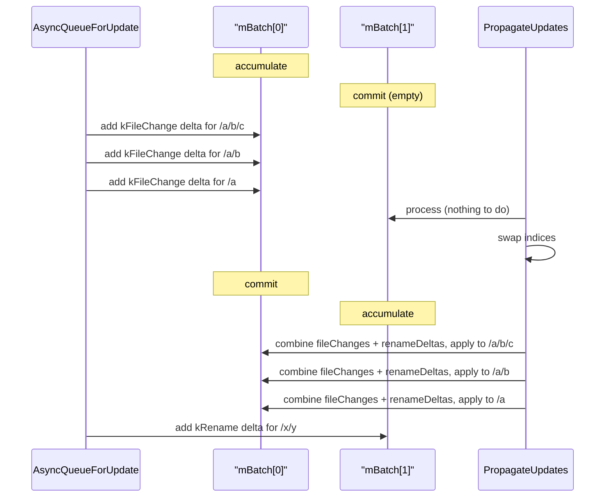
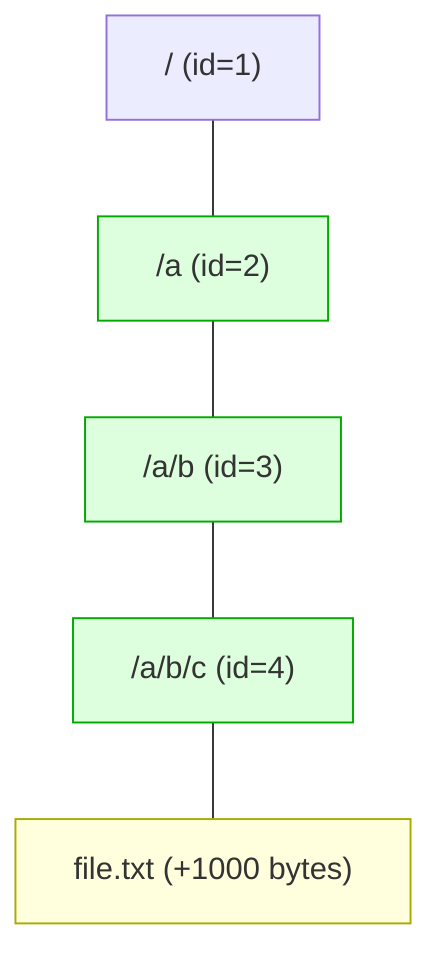
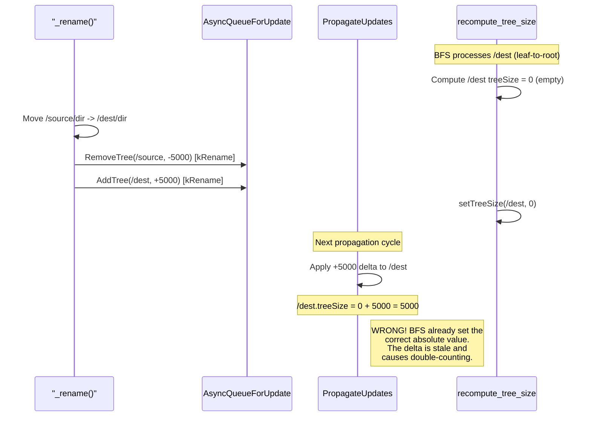
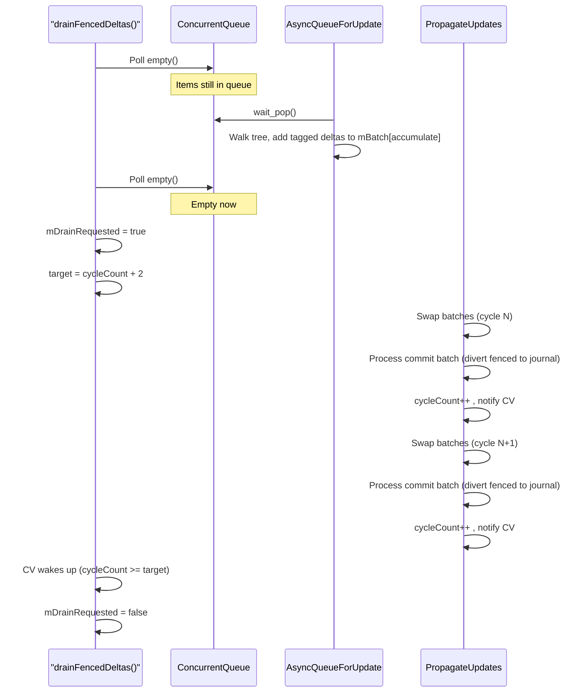
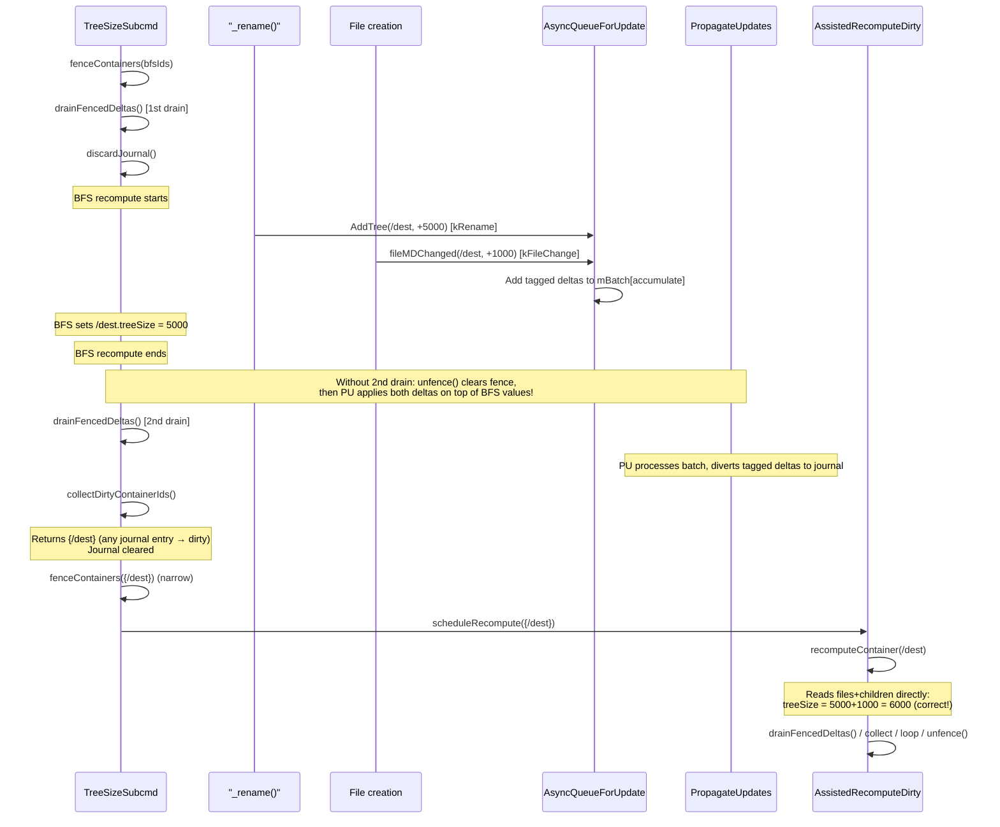

# ContainerAccounting: Tree Size Propagation and Recompute Fencing

## TL;DR

Every EOS directory tracks aggregate counters (`treeSize`, `treeFiles`, `treeContainers`)
for its whole subtree. These counters are maintained incrementally as files and
directories are created, deleted, resized, or moved. Occasionally an operator runs a
**manual recompute** on a subtree to re-derive the "true" values from scratch.

The hard problem this module solves is the **race between the manual recompute and
ongoing live traffic**: while the recompute is walking the subtree computing absolute
values, concurrent file operations and renames keep generating incremental deltas that
want to update the very same counters. Applying both at once silently corrupts the
accounting — you end up with phantom files, negative counts, or stale sizes that never
self-heal.

**The solution, in one sentence:** while a recompute is in flight we *fence* the
affected containers (diverting their incremental deltas into a side journal instead of
applying them), and once the recompute is done an *async thread* walks the journal, re-
derives correct values for every container that was touched during the fence, iterates
until the journal stops growing, and only then unfences — guaranteeing that no update
is lost and no stale value survives.

Two subtle bugs were fixed along the way:

1. **Rename-only deltas were being discarded.** The old "is this container dirty?"
   check only flagged containers that had seen a file-change event, so subtrees
   touched purely by concurrent `mv` operations kept their stale recompute values.
   Fix: treat *any* journal entry as dirty.
2. **The iteration cap could leak a stale batch.** If the recompute loop hit its
   iteration limit with a non-empty "new dirty" set, that final batch was unfenced
   without ever being recomputed. Fix: do a final-pass recompute before unfencing.

The rest of this document explains the machinery in detail.

---

## Overview

`QuarkContainerAccounting` is responsible for maintaining **subtree accounting** in the
EOS namespace. Every directory (container) tracks three aggregate values over its
entire subtree:

| Field | Meaning |
|---|---|
| `treeSize` | Total size in bytes of all files in the subtree |
| `treeFiles` | Total number of files in the subtree |
| `treeContainers` | Total number of subdirectories in the subtree |

These values are updated incrementally via **deltas** whenever a file is created,
deleted, resized, or when a directory is moved between parents.

---

## Architecture

### Threading Model

The accounting system uses three threads:

```
                         Callers
                  (file ops, rename, ...)
                           |
                    QueueForUpdate()
                           |
                           v
              +----------------------------+
              | mIdTreeInfosToUpdateQueue  |    ConcurrentQueue<QueueEntry>
              +----------------------------+    (carries id, delta, DeltaSource tag)
                           |
                     wait_pop()
                           v
              +----------------------------+
              | AsyncQueueForUpdate thread |    Walks from container to root,
              |   (mQueueForUpdateThread)  |    accumulates tagged deltas into mBatch
              +----------------------------+
                           |
                   mBatch[mAccumulateIndx]
                   (TaggedTreeInfos per id)
                           |
                      (swap indices)
                           v
              +----------------------------+
              |  PropagateUpdates thread   |    Combines file-change + rename deltas,
              |       (mThread)            |    applies combined delta to containers
              +----------------------------+
                           |
                           v
                     QuarkDB store
```

### Delta Source Tagging

Every delta entering the system is tagged with a `DeltaSource` indicating its origin:

```cpp
enum class DeltaSource : uint8_t {
  kFileChange = 0,  // File creation, deletion, or size change (default)
  kRename     = 1   // Directory/file move (rename operations)
};
```

The tagging is preserved throughout the entire pipeline — from the concurrent queue,
through the double-buffered batch, and into the recompute journal. This allows the
fencing protocol to **selectively re-apply** file-change deltas while discarding
rename deltas after a BFS recompute.

Tagging happens via two mechanisms:

1. **`AddTree()` / `RemoveTree()`**: Explicitly pass `kRename` to `QueueForUpdate`.
   These handle subtree accounting (total size, files, sub-containers) for directory
   moves.
2. **Thread-local `DeltaSourceScope`**: Rename code paths (in `_rename()` and
   `FuseServer` move operations) set a thread-local `DeltaSource` to `kRename` via
   an RAII scope guard before calling `removeContainer`/`addContainer`/`removeFile`/
   `addFile`. These container/file operations fire `SizeChange` events that reach
   `fileMDChanged()`, which reads the thread-local to determine the tag. This ensures
   that the `{0, 0, ±1}` events from `addContainer`/`removeContainer` and the
   `{±size, ±1, 0}` events from `addFile`/`removeFile` during a rename are correctly
   tagged as `kRename`.

When no `DeltaSourceScope` is active, the thread-local defaults to `kFileChange`,
which is the correct tag for normal file operations (create, delete, resize) and
normal directory operations (mkdir, rmdir).

```cpp
// RAII scope guard for tagging events from the current thread
class DeltaSourceScope {
public:
  explicit DeltaSourceScope(DeltaSource source);
  ~DeltaSourceScope();
private:
  DeltaSource mPrevious;  // Restores previous value on destruction
};
```

The `TaggedTreeInfos` struct stores deltas separated by source:

```cpp
struct TaggedTreeInfos {
  TreeInfos fileChanges;   // Accumulated file-change deltas
  TreeInfos renameDeltas;  // Accumulated rename deltas
};
```

During normal (unfenced) operation, `PropagateUpdates` simply combines both components
before applying to the container:

```cpp
TreeInfos total;
total += elem.second.fileChanges;
total += elem.second.renameDeltas;
cont->updateTreeSize(total.dsize);
```

### Double-Buffered Batch System

To minimize contention between the producer (`AsyncQueueForUpdate`) and the consumer
(`PropagateUpdates`), the system uses a **double-buffered batch** with two `UpdateT`
maps:

```
mBatch[0]  and  mBatch[1]
```

At any given time:
- `mBatch[mAccumulateIndx]` is being filled by `AsyncQueueForUpdate`
- `mBatch[mCommitIndx]` is being drained by `PropagateUpdates`

Each `UpdateT::mMap` maps container IDs to `TaggedTreeInfos`, keeping file-change and
rename deltas separate within each batch entry.

Every propagation cycle (default: 5 seconds), `PropagateUpdates` swaps the two
indices under `mMutexBatch`, so the roles reverse. This ensures the producer never
blocks on the consumer and vice-versa.



### Delta Propagation Up the Tree

When a file changes size or a directory is moved, `QueueForUpdate(containerId, delta,
source)` enqueues a `QueueEntry{containerId, TreeInfos, DeltaSource}` into
`mIdTreeInfosToUpdateQueue`.

The `AsyncQueueForUpdate` thread dequeues this entry and walks **up the tree** from the
given container to the root (`/`, id=1), adding the tagged delta to every ancestor:



If `file.txt` (in container 4) grows by 1000 bytes, deltas of `{+1000, 0, 0}` tagged
as `kFileChange` are added to containers 4, 3, 2 (stopping before id=1 since the loop
condition is `id > 1`).

### Entry Points

| Method | Called by | DeltaSource | Effect |
|---|---|---|---|
| `fileMDChanged()` | `FileMD::setSize()`, `ContainerMD::addFile/removeFile()` | thread-local (`kRename` during file rename, `kFileChange` otherwise) | Queues delta for the file's parent container |
| `fileMDChanged()` | `ContainerMD::addContainer/removeContainer()` | thread-local (`kRename` during rename, `kFileChange` during mkdir/rmdir) | Queues `{0, 0, ±1}` delta for the parent container |
| `AddTree()` | `_rename()` on the destination parent | `kRename` | Queues positive delta (subtree added) |
| `RemoveTree()` | `_rename()` on the source parent | `kRename` | Queues negative delta (subtree removed) |
| `QueueForUpdate()` | All of the above | (passed through) | Enqueues `QueueEntry{id, TreeInfos, DeltaSource}` into `mIdTreeInfosToUpdateQueue` |

---

## The Race Condition (EOS-6577)

### Two Conflicting Update Strategies

There are two operations that modify container tree sizes:

1. **Normal delta propagation** (`PropagateUpdates`): applies incremental deltas via
   `container->updateTreeSize(delta)` -- a relative adjustment.

2. **Recompute tree size** (`eos ns recompute_tree_size` / `NsCmd::UpdateTreeSize`):
   performs a BFS from leaves to root, computing the correct absolute value from
   children and setting it via `container->setTreeSize(absolute)`.

These two strategies are **incompatible** when they run concurrently.

### The Bug Scenario

Consider a rename moving `/source/dir` (treeSize=5000) to `/dest/dir` while
`recompute_tree_size` is running on the same subtree:



**Without the fix**, depending on timing:
- **Double-counting**: BFS sets dest=5000 (correct), then stale delta +5000 is
  applied on top -> dest=10000 (wrong).
- **Under-counting**: BFS sets source=0 (correct), then stale delta -5000 is
  applied -> source underflows.
- **Lost updates**: BFS overwrites a delta-adjusted value before the delta was
  applied.

### Why a Global Lock is Not Acceptable

A global mutex that blocks all rename/file operations during `recompute_tree_size`
would be correct but impractical: the BFS can take **minutes** on large directory
trees (millions of containers), and blocking all file operations for that duration
is unacceptable in production.

---

## The Fix: Recompute Fencing + Async Dirty Recompute

### Concept

The fix introduces a **fencing mechanism** in `QuarkContainerAccounting` that
coordinates the two update strategies without a global lock, plus an **async
dirty recompute thread** that re-derives correct values for any container that
was touched during the BFS:

- Before the BFS, **fence** all containers in the BFS set.
- While fenced, `PropagateUpdates` **diverts** deltas for fenced containers into a
  **journal** instead of applying them to the namespace. The journal preserves the
  `DeltaSource` tags.
- After the BFS, identify any container with a journal entry as **dirty**
  (either a file-change or a rename delta means BFS captured it in an
  intermediate state). The journal is cleared but the **dirty set stays fenced**.
- A background thread **recomputes each dirty container from current namespace
  state** (re-reading files and child container tree values directly), in
  leaf-to-root order. Iteration repeats until no new dirty containers are
  discovered, then the thread unfences.

The key insight: **the journal does not need to be re-applied as deltas**.
Whatever delta was captured represents a change that already happened to the
underlying files/children. Re-reading the container's contents after the change
gives the correct absolute value directly. Both file-change and rename deltas
trigger a recompute — they are equally indicative of "this container's tree
counts may be stale."

```mermaid
flowchart TD
    subgraph "TreeSizeSubcmd (recompute_tree_size)"
        A["Collect BFS container IDs"] --> B["fenceContainers(bfsIds)"]
        B --> C["drainFencedDeltas()"]
        C --> D["discardJournal()"]
        D --> E["Run BFS recompute<br/>(leaves to root, setTreeSize)"]
        E --> F["drainFencedDeltas()"]
        F --> G["collectDirtyContainerIds()"]
        G --> H{"Dirty<br/>set empty?"}
        H -- Yes --> I["unfence()"]
        H -- No --> J["fenceContainers(dirtyIds)<br/>(narrow fence)"]
        J --> K["scheduleRecompute(dirtyIds)"]
    end

    subgraph "AssistedRecomputeDirty (async)"
        R1["Wait for pending dirty IDs"] --> R2["Sort batch leaf-to-root"]
        R2 --> R3["recomputeContainer for each<br/>(read files+children, set absolute)"]
        R3 --> R4["drainFencedDeltas()"]
        R4 --> R5["collectDirtyContainerIds()"]
        R5 --> R6{"New dirty<br/>found?"}
        R6 -- Yes, iter < cap --> R7["fenceContainers(newDirty)<br/>narrow further"]
        R7 --> R2
        R6 -- No, or cap hit --> R8["Final pass: recompute<br/>any leftover batch"]
        R8 --> R9["unfence()"]
    end

    subgraph "PropagateUpdates (concurrent)"
        PU1["Swap batch indices"]
        PU2{"Container<br/>fenced?"}
        PU3["Combine fileChanges + renameDeltas<br/>Apply delta to container"]
        PU4["Divert TaggedTreeInfos<br/>to journal (preserving tags)"]
        PU1 --> PU2
        PU2 -- No --> PU3
        PU2 -- Yes --> PU4
    end
```



### The Protocol in Detail

The protocol has **two phases**: a synchronous fencing phase executed by
`TreeSizeSubcmd`, followed by an asynchronous dirty-recompute phase executed
by the `AssistedRecomputeDirty` thread.

#### Phase A: Synchronous fencing (TreeSizeSubcmd)

#### Step 1: `fenceContainers(bfsIds)`

Sets `mFencedIds` to the set of all container IDs in the BFS. From this point on,
`PropagateUpdates` will divert deltas for these containers into `mRecomputeJournal`
instead of applying them. The journal stores `TaggedTreeInfos`, preserving the
`kFileChange` vs `kRename` separation.

#### Step 2: `drainFencedDeltas()` (first drain)

Waits until all **pre-existing in-flight deltas** have been processed:

1. Polls `mIdTreeInfosToUpdateQueue.empty()` until the concurrent queue is drained
   (all items picked up by `AsyncQueueForUpdate`).
2. Sets `mDrainRequested = true` to make `PropagateUpdates` skip its sleep interval.
3. Waits for **two full propagation cycles** via `mDrainCompleteCV`:
   - Cycle 1: items in the old accumulate batch are swapped to commit and processed.
   - Cycle 2: items that `AsyncQueueForUpdate` put into the new accumulate batch
     (while cycle 1 was running) are also processed.
4. Sets `mDrainRequested = false`.



#### Step 3: `discardJournal()` (first discard)

Clears `mRecomputeJournal`. The pre-BFS deltas that were diverted during the drain
are now discarded. This is safe because the BFS will recompute correct absolute
values from scratch, and any file-change deltas in this batch predate the BFS snapshot.

#### Step 4: Run BFS recompute

The standard BFS recompute (`UpdateTreeSize`) processes containers from **leaves to
root**, ensuring each parent reads already-corrected child values. For each container:

1. Iterate all files, sum their sizes.
2. Iterate all child containers, sum their `treeSize`, `treeFiles`, `treeContainers`.
3. Set the absolute values via `setTreeSize()`, `setTreeFiles()`, `setTreeContainers()`.

During this time, concurrent operations (renames, file creates) may queue new deltas.
These deltas are diverted to the journal by `PropagateUpdates` because the containers
are still fenced. The journal preserves the `DeltaSource` tag for each delta.

#### Step 5: `drainFencedDeltas()` + `collectDirtyContainerIds()` (second drain)

This step ensures every delta produced during the BFS is captured into the
journal so we can identify which containers BFS may have caught in an
intermediate state:

- **`drainFencedDeltas()`**: Ensures all deltas queued **during** the BFS (from
  concurrent renames or file operations) are flushed from the concurrent queue and
  batch system into the journal. Without this second drain, deltas still sitting in
  the accumulate batch would escape the fence when we unfence and get applied on top
  of the absolute values.
- **`collectDirtyContainerIds()`**: Returns the set of container IDs that have **any**
  journal entry — file-change or rename. The journal is cleared. Both kinds of deltas
  indicate a container whose tree counts may be stale relative to the absolute value
  BFS just wrote, so both must trigger a recompute. (Earlier versions used only
  file-change activity; this missed rename-only corrections, leaving thousands of
  ancestor containers permanently stale — see EOS-6577.)

#### Step 6: Narrow the fence and hand off to async recompute

```cpp
auto dirtyIds = accounting->collectDirtyContainerIds();
if (!dirtyIds.empty()) {
  accounting->fenceContainers(dirtyIds);            // narrow fence
  accounting->scheduleRecompute(std::move(dirtyIds));
} else {
  accounting->unfence();
}
```

`fenceContainers(dirtyIds)` **replaces** the current fence set with the (smaller)
dirty set. Containers that were in the BFS but did not receive any deltas are now
unfenced and resume normal delta propagation immediately. Dirty containers stay
fenced so that any further deltas arriving for them are still diverted to the journal
while the async recompute is running. `scheduleRecompute` posts the dirty set to the
async thread and returns. `TreeSizeSubcmd` then returns to the caller.

If no containers were dirty, the BFS captured the truth, and we unfence directly.

#### Phase B: Asynchronous dirty recompute (AssistedRecomputeDirty)

The `mDirtyRecomputeThread`, started in `setFileMDSvc()`, waits on
`mDirtyRecomputeCV` for a non-empty `mPendingDirtyRecompute` set, then runs the
following loop (capped at `kMaxDirtyRecomputeIterations = 3`):

1. **Sort by depth descending** (leaf-to-root) so each parent reads
   already-corrected child tree values.
2. **`recomputeContainer(id, batch)`** for each id: read the current files
   (sum sizes, count) and current child containers (sum their `treeSize`,
   `treeFiles`, `treeContainers + 1`). Set the absolute values. If the parent
   is **not** in the dirty set, queue a delta correction for the parent via
   the normal pipeline; otherwise the parent will recompute itself from
   already-corrected children.
3. **`drainFencedDeltas()`** flushes any deltas produced by concurrent
   operations during the recompute.
4. **`collectDirtyContainerIds()`** returns the new dirty set (containers that
   accumulated deltas while the recompute pass was running). If non-empty,
   **`fenceContainers(newDirty)`** narrows the fence again and the loop runs
   another iteration.
5. **Final pass**: if the iteration cap is hit while the batch is still
   non-empty (e.g. a steady stream of new operations on the same containers),
   the loop exits but the leftover batch is recomputed one more time before
   `unfence()`. This prevents leaving stale tree values behind in the rare case
   where convergence does not happen within 3 iterations.
6. **`unfence()`** clears the fence and journal; normal propagation resumes for
   all containers.

### Why Tag Deltas at All?

Tagging is no longer used to *select* which deltas to re-apply (the recompute
phase derives correct values directly from namespace state). Tags are still
useful operationally:

- The journal stores `fileChanges` and `renameDeltas` separately so the
  invariants in `TaggedTreeInfos` are preserved end-to-end (e.g. for
  diagnostics / future tests).
- `PropagateUpdates` combines both components when applying to unfenced
  containers, so the on-the-wire behavior for non-recompute traffic is
  unchanged.
- `addContainer`/`removeContainer` and `addFile`/`removeFile` events fired
  during a rename are tagged `kRename` via the thread-local `DeltaSourceScope`
  RAII guard, while the same events from `mkdir`/`rmdir`/file creation are
  tagged `kFileChange`. Even though both currently flag a container as dirty,
  the distinction lets us treat the two flows differently if needed and helps
  reasoning about the journal.

### Why Two Drains Are Necessary



---

## Corner Cases

### 1. Rename During BFS Between Already-Processed and Not-Yet-Processed Containers

**Scenario**: BFS has already processed `/source` (set treeSize=5000) but hasn't
processed `/dest` yet. A rename moves `/source/dir` to `/dest/dir`.

**What happens**:
- The rename's `RemoveTree(/source, -5000)` and `AddTree(/dest, +5000)` are tagged
  as `kRename` and diverted to the journal (both containers are fenced).
- The rename's `removeContainer("dir")` on `/source` and `addContainer(dir)` on `/dest`
  fire `{0, 0, -1}` and `{0, 0, +1}` events. Because the rename code runs under a
  `DeltaSourceScope(kRename)`, `fileMDChanged` reads the thread-local and tags them
  `kRename`.
- When BFS later processes `/dest`, it sees `/dest/dir` as a child and computes the
  correct absolute value. `/source` is already done and is now stale.
- After the BFS, `collectDirtyContainerIds()` returns **both** `/source` and `/dest`
  (and all of their ancestors) because each has a journal entry. Both are re-fenced
  and handed to `AssistedRecomputeDirty`, which re-derives correct values from
  current namespace state.

**Resolution**: Both source and destination converge to the correct values by the
time `AssistedRecomputeDirty` finishes. Critical invariants preserved: **no
double-counting, no underflow corruption, and no permanent drift on the rename
source**. (Earlier versions only flagged file-change activity here; the rename source
was silently left stale. That was the EOS-6577 root cause.)

### 2. File Creation/Deletion During BFS

**Scenario**: A new file is created in a fenced container while BFS is running. The
BFS may or may not have already processed this container.

**What happens**:
- The `fileMDChanged` event queues a delta tagged as `kFileChange`.
- `AsyncQueueForUpdate` walks up to root and adds the tagged delta to the batch.
- `PropagateUpdates` diverts the `TaggedTreeInfos` to the journal (container is fenced).
- The second drain captures it into the journal.
- `collectDirtyContainerIds()` flags the container and all ancestors as dirty. They
  are handed to `AssistedRecomputeDirty`, which reads the current files and child
  containers and writes the correct absolute values.

**Resolution**: After the async recompute the tree counts reflect reality regardless
of whether BFS happened to see the file. No additive re-apply is involved, so there
is no risk of double-counting against the BFS snapshot.

### 3. File Size Change During BFS

**Scenario**: A file in a fenced container changes size while BFS is running.

**What happens**:
- Same as file creation: the `kFileChange`-tagged delta is diverted to the journal,
  the container is flagged dirty by `collectDirtyContainerIds()`, and the async
  recompute reads the current file size directly.

**Resolution**: The container's `treeSize` is re-derived from the file's current
size, so it is correct whether BFS read the old or the new value.

### 4. Container Creation/Deletion During BFS (mkdir/rmdir)

**Scenario**: A new subdirectory is created (`mkdir`) in a fenced container while BFS
is running, or an empty directory is removed (`rmdir`).

**What happens**:
- `addContainer()` fires a `SizeChange` event with `{0, 0, +1}`. Since this is a normal
  mkdir (no `DeltaSourceScope` active), the thread-local defaults to `kFileChange`.
- The delta is diverted to the journal, the parent container is flagged dirty, and
  `AssistedRecomputeDirty` re-counts current children (including the new subdirectory).

**Resolution**: This is correct behavior. The thread-local `DeltaSourceScope` approach
cleanly distinguishes mkdir/rmdir events (`kFileChange`) from rename events (`kRename`)
because the tagging happens at the call site, not by inspecting the event payload.
The async recompute uses the live `ContainerMapIterator`, so any structural change
that completed before the recompute reads the parent is reflected.

### 5. PropagateUpdates Mid-Batch When Fencing Starts

**Scenario**: `PropagateUpdates` is in the middle of iterating the commit batch when
`fenceContainers()` is called.

**What happens**:
- `PropagateUpdates` partitions the batch at the **start** of each cycle (after the
  swap), not mid-iteration. The fence check happens once per cycle under a read lock.
- If `fenceContainers()` is called between cycles, the next cycle will correctly
  partition the batch.
- If it's called during a cycle, the current cycle has already partitioned (with the
  old, empty fence set), so those deltas are applied normally. This is safe because
  the BFS hasn't started yet (the first drain hasn't completed).

### 6. Multiple Concurrent `recompute_tree_size` Commands

**Scenario**: Two `recompute_tree_size` commands run on overlapping subtrees, **or**
a new `recompute_tree_size` is issued while `AssistedRecomputeDirty` from a previous
invocation is still running.

**What happens**:
- `fenceContainers()` **replaces** the fence set (it's an assignment, not a union).
- The second command's fence overwrites the first's, potentially unfencing containers
  that the first BFS or the still-running async recompute is still processing.
- A new `scheduleRecompute()` call merges its IDs into `mPendingDirtyRecompute`, so
  the dirty thread will eventually pick them up — but if the previous iteration
  was mid-flight on a now-unfenced container, deltas may slip through the
  fence in the gap.

**Resolution**: This is **not supported**. Only one `recompute_tree_size` should run
at a time, and callers should allow the async recompute to finish before issuing
another. In practice, `eos ns recompute_tree_size` is an admin command run manually
or by `fsck`. A future improvement could add a mutex in `TreeSizeSubcmd` to serialize
concurrent recomputes and wait for the async thread to drain `mPendingDirtyRecompute`.

### 7. `drainFencedDeltas()` When `update_interval = 0` (Synchronous Mode)

**Scenario**: ContainerAccounting is configured with `update_interval = 0`, meaning
async threads are disabled.

**What happens**:
- `drainFencedDeltas()` polls the queue until empty, then waits for 2 propagation
  cycles via `mDrainCompleteCV`. But the `PropagateUpdates` thread is not running.

**Resolution**: When `update_interval = 0`, the async threads are never started
(constructor skips `mThread.reset()`). The `gOFS->eosContainerAccounting` pointer
would still be set, but `drainFencedDeltas()` would block indefinitely. In practice,
`update_interval = 0` disables async accounting entirely and is only used in
specific test configurations. The `dynamic_cast` in `TreeSizeSubcmd` guards against
null, but this edge case should be documented if synchronous mode is ever used with
recompute.

### 8. Fencing Containers Outside the BFS Set

**Scenario**: A rename queues deltas for container X, which is an ancestor of the BFS
root but is NOT in the fenced set (e.g., `/` when only `/test/` subtree is recomputed).

**What happens**:
- The delta for X is **not** fenced. `PropagateUpdates` applies it normally.
- This is correct: the BFS only sets absolute values for containers in the BFS set.
  Ancestors above the BFS root are updated via normal delta propagation and are
  unaffected by the recompute.

### 9. Destructor Race With Drain

**Scenario**: `~QuarkContainerAccounting()` is called while `drainFencedDeltas()` is
waiting.

**What happens**:
- The destructor enqueues `(0, {0,0,0}, kFileChange)` to stop `AsyncQueueForUpdate`,
  then joins both threads.
- Joining `mThread` (PropagateUpdates) causes it to stop, which will fire the final
  `mDrainCompleteCV.notify_all()`.
- `drainFencedDeltas()` will wake up once the cycle count reaches its target, or when
  the thread terminates.

**Resolution**: In practice, destruction happens during MGM shutdown, and
`recompute_tree_size` would not be running. If it were, the drain would eventually
unblock when the threads terminate.

---

## Data Structures

### Delta Tagging

| Type | Purpose |
|---|---|
| `DeltaSource` (enum) | Tags each delta as `kFileChange` (file ops) or `kRename` (rename/move ops) |
| `DeltaSourceScope` (RAII class) | Sets thread-local `DeltaSource` for the current scope; restores previous value on destruction |
| `TaggedTreeInfos` (struct) | Stores `fileChanges` and `renameDeltas` as separate `TreeInfos` components |
| `QueueEntry` (struct) | Entry in `mIdTreeInfosToUpdateQueue`: `{id, delta, DeltaSource}` |

The tagging flows through the entire pipeline:

```
QueueEntry(id, delta, kFileChange)
    → AsyncQueueForUpdate → batch.mMap[id].fileChanges += delta
        → PropagateUpdates (unfenced) → combine fileChanges + renameDeltas, apply
        → PropagateUpdates (fenced)   → journal[id].fileChanges += delta
            → collectDirtyContainerIds() → returns id (any journal entry)
            → AssistedRecomputeDirty → recomputes id from current state
```

### Fencing State

| Member | Type | Purpose |
|---|---|---|
| `mFenceMutex` | `eos::common::RWMutex` | Read-locked by `PropagateUpdates` (hot path), write-locked by fence/unfence/collect (cold path) |
| `mFencedIds` | `unordered_set<id_t>` | Set of container IDs currently being recomputed |
| `mRecomputeJournal` | `unordered_map<id_t, TaggedTreeInfos>` | Accumulated tagged deltas diverted from fenced containers |
| `mDrainRequested` | `atomic<bool>` | When true, `PropagateUpdates` skips its sleep interval |
| `mPropagationCycleCount` | `atomic<uint64_t>` | Monotonically increasing counter, incremented after each propagation cycle |
| `mDrainCompleteMutex` | `std::mutex` | Protects `mDrainCompleteCV` |
| `mDrainCompleteCV` | `std::condition_variable` | Signaled after each propagation cycle; `drainFencedDeltas()` waits on it |

### Async Dirty Recompute State

| Member | Type | Purpose |
|---|---|---|
| `mFileMDSvc` | `IFileMDSvc*` | File MD service used by `recomputeContainer` to read individual file sizes |
| `mDirtyRecomputeThread` | `AssistedThread` | Background thread running `AssistedRecomputeDirty` |
| `mDirtyRecomputeMutex` | `std::mutex` | Protects `mPendingDirtyRecompute` |
| `mDirtyRecomputeCV` | `std::condition_variable` | Signaled by `scheduleRecompute()` to wake the thread |
| `mPendingDirtyRecompute` | `unordered_set<id_t>` | Pending dirty container IDs awaiting recompute |

### Batch Structure

| Member | Type | Purpose |
|---|---|---|
| `mBatch` | `vector<UpdateT>` (size 2) | Double-buffered batch for delta accumulation/commit |
| `UpdateT::mMap` | `unordered_map<id_t, TaggedTreeInfos>` | Per-container tagged deltas within a batch |
| `mAccumulateIndx` | `uint8_t` | Index of the batch being filled |
| `mCommitIndx` | `uint8_t` | Index of the batch being drained |
| `mMutexBatch` | `std::mutex` | Protects index swap |

### Lock Ordering

To prevent deadlocks, locks are always acquired in this order:

1. `mFenceMutex` (read or write)
2. `mMutexBatch`

`PropagateUpdates` acquires `mMutexBatch` for the swap, releases it, then acquires
`mFenceMutex` (read) for the partition. These are never held simultaneously.

---

## Performance Considerations

### Normal Operations (No Recompute Running)

When no recompute is in progress, `mFencedIds` is empty. The overhead added to
`PropagateUpdates` per cycle is:

1. One `eos::common::RWMutexReadLock` acquisition on `mFenceMutex`.
2. One `mFencedIds.empty()` check (returns true immediately).
3. One `mPropagationCycleCount.fetch_add(1)` (atomic increment).
4. One `mDrainCompleteCV.notify_all()` (no waiters, returns immediately).

The `TaggedTreeInfos` struct adds one extra `TreeInfos` field (24 bytes) per batch
entry compared to a single `TreeInfos`, but since the struct is combined before
application, the per-entry cost to QuarkDB is unchanged.

This is **negligible** compared to the existing per-entry `getContainerMD()` +
`ContainerWriteLock` + `updateStore()` cost.

### During Recompute

| Operation | Cost | When |
|---|---|---|
| Fence set check | O(1) per batch entry (hash lookup) | Every propagation cycle |
| Batch partitioning | O(F) where F = number of fenced entries in batch | Every propagation cycle |
| Journal merge (tagged) | O(F) per cycle | Every propagation cycle with fenced entries |
| First drain | ~milliseconds (2 fast cycles) | Once at recompute start |
| Second drain | ~milliseconds (2 fast cycles) | Once at recompute end (and once per async iteration) |
| `collectDirtyContainerIds()` | O(J) where J = journal size | Once at recompute end + once per async iteration |
| Async `recomputeContainer` | O(files+children) per dirty container, in leaf-to-root order | Per dirty container, per iteration (capped at 3 + final pass) |
| Memory | O(N) for fence set + O(N) for journal (TaggedTreeInfos) + O(D) for dirty set, where N = BFS containers, D = dirty containers | Duration of recompute (sync phase + async phase) |

### Potential Bottlenecks

#### 1. Large BFS Sets

For very deep or wide directory trees, the BFS set can contain millions of container
IDs. The `unordered_set` lookup is O(1) amortized, but the memory footprint of
`mFencedIds` (and `mRecomputeJournal`) grows linearly. For a tree with 10 million
containers at ~8 bytes per ID, the fence set alone is ~80 MB. The journal entries are
larger (`TaggedTreeInfos` = 48 bytes per entry) but bounded by the number of unique
container IDs that receive deltas during the BFS.

**Mitigation**: `recompute_tree_size` accepts a `depth` parameter to limit the BFS
depth. Operators can recompute subtrees incrementally.

#### 2. Drain Latency

`drainFencedDeltas()` waits for the concurrent queue to empty and for 2 propagation
cycles. If the queue has a large backlog (e.g., many concurrent file operations), the
drain can take longer.

With `mDrainRequested = true`, `PropagateUpdates` skips its 5-second sleep, so cycles
complete in the time it takes to apply the batch. The queue drain polls every 10ms.

In the worst case, drain latency is dominated by the time to process a large batch of
unfenced entries (the fenced entries are just diverted, not applied to QuarkDB).

#### 3. Read Lock Contention on `mFenceMutex`

`PropagateUpdates` holds a read lock on `mFenceMutex` during the batch partition.
`fenceContainers()`, `collectFileChangeDeltas()`, and `unfence()` require a write lock.
If the batch is very large, the read lock is held for the duration of the partition
loop, blocking fence/unfence operations.

**Mitigation**: The partition loop only copies `TaggedTreeInfos` structs (48 bytes
each) and erases from an `unordered_map`. This is fast even for large batches. The
write lock operations (fence/unfence/collect) are called at most a few times per
recompute (not on the hot path).

#### 4. Stale Delta Accumulation in the Journal

During a long-running BFS, the journal accumulates diverted tagged deltas. These are
merged (same container ID deltas are summed per tag), so the journal size is bounded
by the number of unique fenced container IDs that receive deltas during the BFS, not
the total number of operations.

---

## File Map

| File | Role |
|---|---|
| `namespace/ns_quarkdb/accounting/ContainerAccounting.hh` | Class declaration with `DeltaSource`, `TaggedTreeInfos`, and fencing API |
| `namespace/ns_quarkdb/accounting/ContainerAccounting.cc` | Implementation of tagged delta propagation, fencing, and async dirty recompute (`AssistedRecomputeDirty`, `recomputeContainer`) |
| `mgm/proc/admin/NsCmd.cc` | `TreeSizeSubcmd` orchestrates the fencing protocol; hands the dirty set to `scheduleRecompute` and returns |
| `namespace/ns_quarkdb/NamespaceGroup.cc` | Wires `setFileMDSvc()` so the dirty recompute thread can iterate files |
| `mgm/ofs/cmds/Rename.inc` | `_rename()` uses `DeltaSourceScope(kRename)` for both directory and file moves; calls `AddTree`/`RemoveTree` for directory moves |
| `mgm/FuseServer/Server.cc` | FUSE move operations use `DeltaSourceScope(kRename)` for container, file, and symlink moves |
| `namespace/interface/IFileMDSvc.hh` | `TreeInfos` struct and `IFileMDChangeListener` interface |
| `namespace/ns_quarkdb/tests/HierarchicalViewTest.cc` | Unit tests for fencing and tagged delta behavior |
| `test/eos-accounting-test` | Integration test for concurrent move + recompute |

---

## Unit Tests

| Test | What it verifies |
|---|---|
| `FencingPreventsDeltaPropagation` | Deltas for fenced containers are not applied; after unfence, new deltas propagate normally |
| `DrainAndDiscardJournal` | `drainFencedDeltas()` captures in-flight deltas; `discardJournal()` clears them |
| `RecomputeWithFencing` | Full protocol (fence/drain/discard/BFS/drain/collect/unfence) corrects a corrupted tree size |
| `ConcurrentMoveAndRecompute` | Move during fenced BFS does not corrupt absolute values; the journal contains rename deltas which the dirty recompute resolves |
| `MoveWithoutFencingCorruptsTreeSize` | Negative test: move + recompute without fencing produces incorrect values |
| `CollectFileChangeDeltas` | File-change deltas are returned by `collectFileChangeDeltas()`; rename deltas are discarded; verifies per-container and per-tag correctness |
| `FileCreationDuringRecompute` | File created during BFS: dirty recompute corrects the tree size and file count after unfencing |
